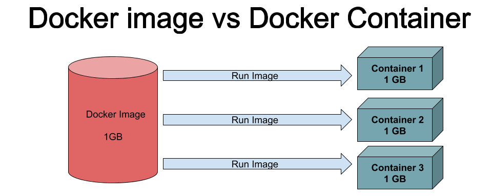
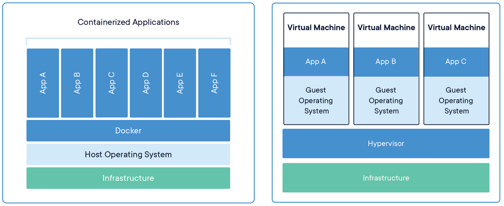
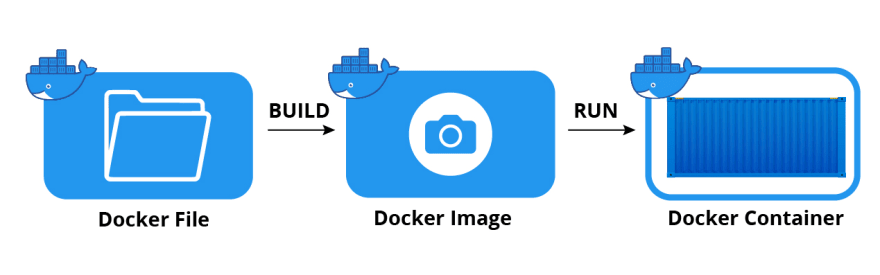

# Docker Mastering

Sure! Here's a **layman's explanation** of **Docker**:

---

## What is Docker?

---
* Docker is a tool that helps developers **package applications** with everything needed to run: code, libraries, tools, and configurations.
* These packages are called **containers**.
* Containers **run the same everywhere** — your laptop, a coworker’s computer, a server, or the cloud.

---

## Real life analogy

Imagine you're a **chef** and you want to **share a recipe** with someone — not just the ingredients, but also the **exact kitchen setup** so the dish turns out **exactly the same**.

Docker is like a **magic lunchbox** where you can pack:

* Your food (the app),
* The oven and stove (runtime environment),
* The utensils (dependencies),
* Even the recipes (code & settings).

Then, you send this box anywhere — and **whoever opens it can eat or cook the same dish**, no matter what kitchen they have.

## Why is Docker useful?

| Without Docker                     | With Docker                   |
| ---------------------------------- | ----------------------------- |
| “It works on my machine!” problems | App works the same everywhere |
| Manual software setup is painful   | Everything is pre-packed      |
| Conflicts between app versions     | Each app runs in its own box  |
| Wastes resources using full VMs    | Lightweight and fast          |

---

## Technical Naming/Keyword with real life analogy

| Concept          | Analogy                               |
| ---------------- | ------------------------------------- |
| Docker Image     | A read-only template used to create containers (like an app snapshot) (Blueprint or frozen lunch box )        |
| Docker Container | A running instance of a Docker image (isolated environment),(A lunch box in use )         |
| Dockerfile       | A script with instructions to build a Docker image (FROM, COPY, RUN,The instruction list to build the box) |
| Docker Daemon       | The background service that manages Docker objects. |
| Build       | Process of turning a Dockerfile into an image: docker build |
| Run       | Launches a container from an image: docker run |
| Volume       | Used to persist data outside the container lifecycle (e.g., databases). |
| Network       | Docker networking is how containers talk to each other and to the outside world (like your browser or a database server).There are multiple types of network but default one is  Bridge  |
| Docker Hub       | A centralize location to store images like github,bitbucket.(A recipe store (public images) )       |
| Docker Compose       | A tool to define and run multi-container apps using docker-compose.yml |
| Service (in Compose)      | Each container defined in docker-compose.yml |

---


## Management & Commands

| Keyword                          | Description                                |
| -------------------------------- | ------------------------------------------ |
| **`docker pull`**               | Pull an image from docker hub.         |
| **`docker build`**               | Builds an image from a Dockerfile.         |
| **`docker run`**                 | Runs a container from an image.            |
| **`docker ps`**                  | Lists running containers.                  |
| **`docker stop` / `rm`**         | Stops or removes containers.               |
| **`docker exec`**                | Runs a command inside a running container. |
| **`docker logs`**                | Shows the container’s logs.                |
| **`docker images`**              | Lists all locally available Docker images. |
| **`docker volume`**              | Manages named volumes.                     |
| **`docker network`**             | Manages networks.                          |
| **`docker-compose up` / `down`** | Starts or stops containers from Compose.   |


## Backend App Dockerization

### First create docker network
```
docker network create demo
```
### Run the mongodb container
```
docker run --network=demo --name mongodb -d -p 27017:27017 -v ~/opt/data:/data/db mongodb:latest
```
### Build the docker image
```
docker build -t todo-backend .
```

### Run the container
```
docker run --name=backend --network=demo -d -p 8765:8765 todo-backend
```

## Image Presentation of docker




